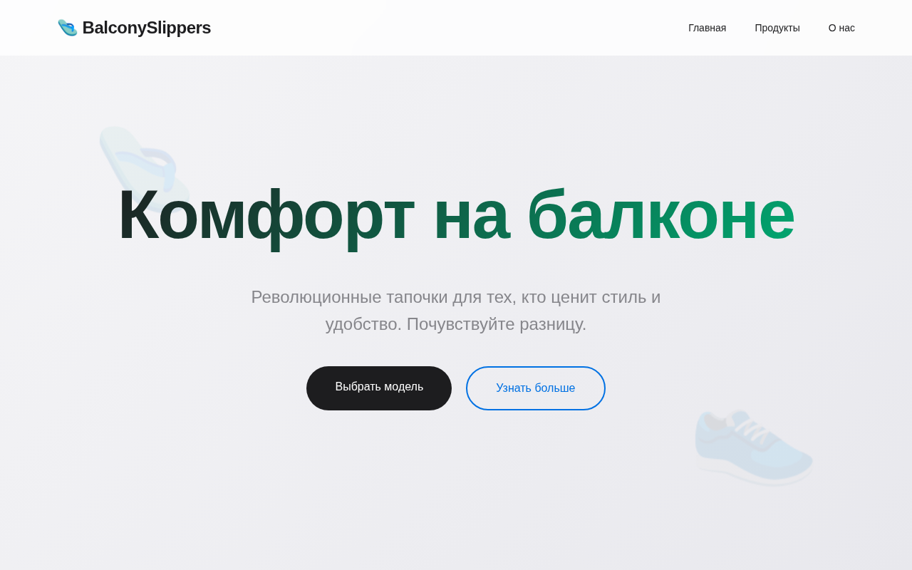
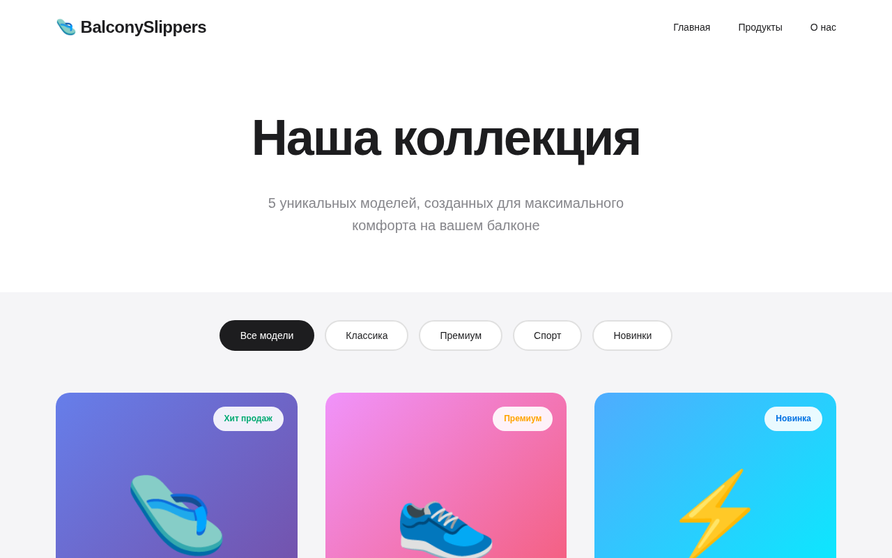
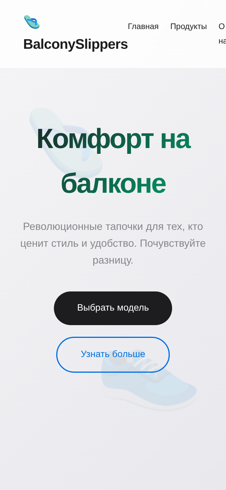

<a href="https://github.com/klaschukk/tapocki-project"></a>

**A small full-stack online shop for slippers** — catalogue, cart, checkout, customer accounts and an admin panel, built with Flask.

The storefront is in Russian. It is a learning project and runs on an in-memory store, so it needs no database and resets when the server restarts.



## Features

**Shoppers**
- Catalogue with category filters and a product page for every model
- Cart with quantity updates, then checkout
- Registration, login and a profile page

**Admin panel**
- Dashboard, product create / edit / delete
- Order list with status updates

**Also**
- JSON endpoints: `/api/products`, `/api/product/<id>`, `/api/cart/count`

## Stack

| | |
|---|---|
| Backend | Flask 3, Flask-Login, Werkzeug password hashing |
| Templates | Jinja2, plain HTML / CSS / JS |
| Data | In-memory store seeded with sample products (`database/db.py`) |

## Run it

```bash
pip install -r requirements.txt
python run.py          # http://localhost:5004
```

A demo admin account is seeded in `database/db.py` (`_SEED_ADMIN`). Change its credentials before exposing the app anywhere but your own machine.

## Screens

<table>
  <tr>
    <td width="66%"></td>
    <td width="34%"></td>
  </tr>
</table>

## Project layout

```
app.py · run.py        entry points
routes/                main, products, cart, auth, admin blueprints
models/                user and order models
database/db.py         in-memory store and seed data
templates/ · static/   Jinja2 templates and assets
```
